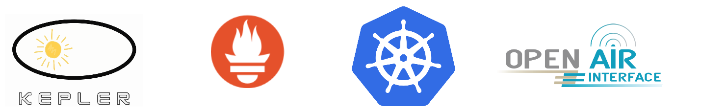
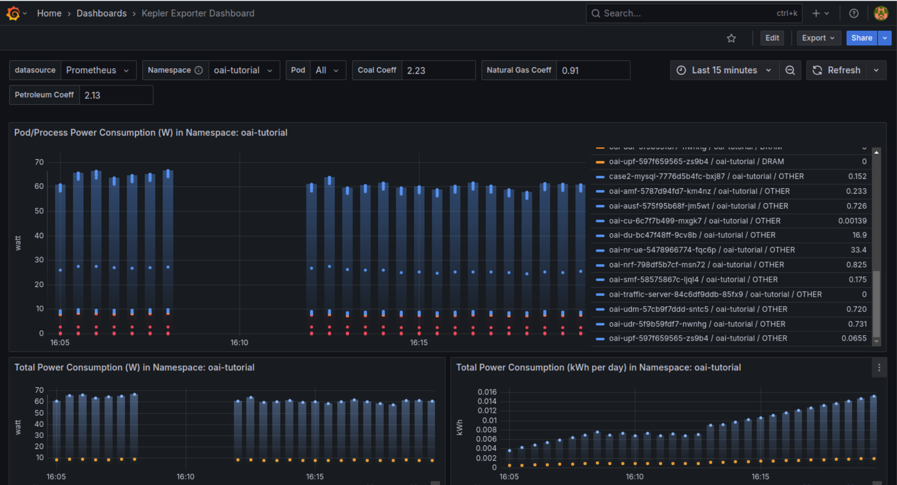

# Green-xG


<p align="center">

</p>

## What is Green-xG

**GreenXG** is a Kubernetes-based multi-cluster O-RAN testbed deployable on **Minikube** that integrates three open-source stacks to support energy-aware, end-to-end 5G experiments.

It uses the **OpenAirInterface CN5G stack** for gNB/CU/DU functions, the **kube-prometheus-stack** for real-time metrics, and **Kepler** for fine-grained power telemetry.

By federating three geographically distributed sites, GreenXG enables realistic studies of roaming, backhaul latency and slice anchoring.

All O-RAN interfaces (E2, A1, O1, F1, Fronthaul Split-7.2x) are exposed natively and power probes feed Prometheus for sub-second energy accounting.

Researchers can rapidly deploy, scale or migrate RAN, core and RIC components, replay reproducible mobility traces and correlate QoS KPIs with per-component energy use.

### GreenXG is a fusion of software stacks 

<p align="center">

</p>

- OAI stack [Link OAI Gitlab](https://gitlab.eurecom.fr/oai/cn5g/oai-cn5g-fed)
- Prometheus stack [Link Prometheus Stack Github](https://github.com/prometheus-community/helm-charts/tree/main/charts/kube-prometheus-stack)
- Kepler [Link Kepler Github](https://github.com/sustainable-computing-io/kepler-helm-chart/tree/main)


## Power Consumption at Different Levels


<p align="center">

</p>


The GreenXG OAI platform consists of the following services, grouped by functional layer:

| Component        | Services                                                   |
|------------------|------------------------------------------------------------|
| **Core**         | `oai-amf`, `oai-ausf`, `oai-nrf`, `oai-smf`, `oai-udm`, `case2-mysql` |
| **CU + DU + RU** | `oai-du`, `oai-cu`                                         |
| **UE**           | `oai-nr-ue`                                                |

## Deployment Tutorial

### Requirements

- Minikube [Link for Install](https://kubernetes.io/fr/docs/tasks/tools/install-minikube/)
- Kubectl (to enable it in a terminal)
    ```bash
    alias kubectl="minikube kubectl --"
    ```
- Flannel (For network configurations) [Link for Install](https://github.com/flannel-io/flannel)
- Helm [Link for Install](https://helm.sh/docs/intro/install/)

- Minikube dashboard launched to see the containers deployed with :
    ```bash
    minikube dashboard
    ```


### Step 1 : Deploy OAI

```bash
helm dependency update e2e_scenarios/case2
helm install case2 e2e_scenarios/case2 -n oai-tutorial
```

### Step 2 : Deploy prometheus

```bash
helm dependency update kube-prometheus-stack/
helm install prometheus kube-prometheus-stack \
    --namespace monitoring \
    --create-namespace \
    --wait
```

#### Get Grafana 'admin' user password by running:
The default password is **prom-operator**, but to check it do this command : 
```bash
kubectl --namespace monitoring get secrets prometheus-grafana -o jsonpath="{.data.admin-password}" | base64 -d ; echo
```
#### Access Grafana local instance:
```bash
export POD_NAME=$(kubectl --namespace monitoring get pod -l "app.kubernetes.io/name=grafana,app.kubernetes.io/instance=prometheus" -oname)
kubectl --namespace monitoring port-forward $POD_NAME 3000
```

### Step 3 : Deploy kepler

```bash
helm install kepler kepler-helm-chart/chart/kepler \
    --namespace kepler \
    --create-namespace \
    --set serviceMonitor.enabled=true \
    --set serviceMonitor.labels.release=prometheus 
```
